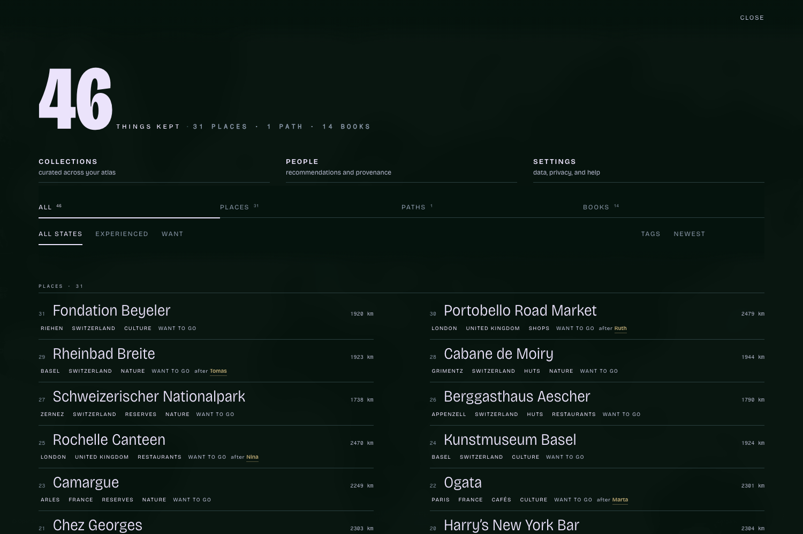

# Resonate

Keep places you love and recommendations from people you trust in a private
atlas your assistant can help you use. Resonate remembers who led you there,
keeps the atlas in your browser, and lets a person decide every lasting change.

Live at [resonate.select](https://resonate.select/).



## WebMCP Challenge

Resonate uses WebMCP because its valuable context exists only in the current
browser. There is no account-backed atlas API for an assistant to impersonate
and no server copy to scrape. WebMCP gives the assistant a small, typed door
into the live page while the ordinary interface remains the place where a
person reviews access and commits changes.

### Connect an agent

The simplest supported path is the latest ChatGPT desktop app. In a personal
workspace, enable **Settings → Browser → Permissions → Enable site tools**, use
ChatGPT Work or Codex with GPT-5.6 Sol or GPT-5.6 Terra, and open Resonate in
the built-in browser. See
[OpenAI's current Site tools guide](https://learn.chatgpt.com/docs/webmcp).

There is no Resonate account, API key, plugin, browser extension, or separate
MCP server to connect. The open page registers its own tools. For a clean
walkthrough, use a browser state that has not opened Resonate. If you need to
clear cookies and site data, first choose **download backup file** in Resonate
Settings: clearing them permanently erases that browser's local atlas.

### Try the complete flow

1. Open [Resonate](https://resonate.select/) in that built-in browser. Choose
   **try an example atlas**, then **Use as my atlas**.
2. Ask:

   > Use Resonate's site tools. Open the assistant-access review first. Do
   > nothing else until I approve and close it.

3. Read the review, press **Allow access**, wait for **on in this browser**, and
   close it. Then ask:

   > Access is approved and the review is closed. Get an atlas overview. Find
   > Paris places with status wishlist, recommended by Marta, kind place, and
   > limit 10. Explain in one sentence why the matches fit together. Open Ogata
   > in Resonate and stop so I can review it.

4. Close Ogata, then ask:

   > I closed Ogata. Prepare an unsaved collection titled “Marta's Paris” from
   > the two IDs returned by that search. Use this note exactly: “Lunch at
   > Septime, then tea and art at Ogata.” Do not save or share it.

5. Leave **save collection** and **copy collection link** untouched, then close
   the untouched draft. In
   **Settings**, press **Stop access**.

A clean run shows one zero-data tool before consent, five bounded tools after
it, exactly **Septime** and **Ogata**, a visible draft with `saved: false` and
`shared: false`, and only the review tool again after revocation. See
[`CHALLENGE.md`](CHALLENGE.md) for the exact trace and recovery steps.

One tool exists before consent; five replace it after consent:

| Tool | Purpose | Lasting effect |
| --- | --- | --- |
| `review_assistant_access` | Open the zero-data review, or bring unfinished setup forward | None; cannot grant access |
| `atlas_overview` | Count disclosed items, cities, tags, and recommendation sources | None |
| `search_atlas` | Find disclosed records, including by `recommended_by` | None |
| `show_atlas_item` | Open one disclosure-safe item on screen | View only |
| `prepare_place` | Open a sourced place proposal | Unsaved until the person adds it |
| `prepare_list` | Open a collection draft from search results | Unsaved until the person saves it |

The WebMCP design rule is simple: **the assistant finds and prepares; the person
decides and commits.** These WebMCP tools cannot claim the owner has visited
somewhere, save, delete, publish, or share.

The implementation is in [`js/agent.js`](js/agent.js). The complete disclosure
and authority contract is in [`ASSISTANT-ACCESS.md`](ASSISTANT-ACCESS.md), with
focused tests in [`test/agent.test.mjs`](test/agent.test.mjs) and adversarial
browser coverage in [`test/browser/atlas.spec.mjs`](test/browser/atlas.spec.mjs).
[`CHALLENGE.md`](CHALLENGE.md) contains the submission story, demo script, and
verification checklist.

### Challenge-period work

Resonate predates the challenge, and its first WebMCP prototype landed on
August 23. During the challenge period, the integration was rebuilt with native
structured results, strict schemas, bounded and stale-safe pagination, explicit
effect metadata, cancellation, registration timeouts, fail-closed consent and
revocation, a zero-data pre-consent review, and cross-tab and back-forward-cache
race tests. This release adds recommendation-source summaries and provenance
search, making the trust network rather than a generic place list available to
the assistant.

This challenge repository began as a one-commit release snapshot. The
[timestamped challenge-period record](https://github.com/jonashertner/resonate/compare/c957ceb65ef329cd078f15e68212d869eddc6f5e...d52219b54ac900d4f8a18b932d5c9596eacee378)
documents the qualifying work added after the last pre-period baseline and
through the September 2 release candidate. The September 3 pre-deadline release
refines the consent handoff, tool guidance, responsive tests, judge instructions,
and matching gallery frame. [`CHALLENGE.md`](CHALLENGE.md) distinguishes the
earlier prototype from that work in detail.

## The idea

Keeping places is easy. Knowing whose recommendations to trust is not.

Resonate holds your places, and lets you hand a set of them to one person as a
link. When someone hands you theirs, your device compares the two atlases: what
you both hold, what you both love, and where they know ground you do not. The
answer is a word, never a score. Keep a person as a voice and their places stay
on your field, open rings you may adopt. One you adopt says after their name,
for good, and pressing that name opens the voice it came from.

## Run it

```bash
node tools/dev.mjs
```

Any static file server works too (`python3 -m http.server 5178`); the dev
server additionally answers range requests and admits the local club mock into
the page's security policy.

Then open http://localhost:5178.

## Release it on the web

The public site is staged from an explicit allowlist, so tests, tools, club
implementation and future native projects cannot enter the Pages artifact by
accident.

```bash
npm ci
npm run verify:web
npm run test:browser
npm run web:stage
```

Maintainers with a repository checkout use `WEB-RELEASE.md` for the controlled
publish and rollback path. Public security and support routes remain available
at [resonate.select/SECURITY.md](https://resonate.select/SECURITY.md) and
[resonate.select/SUPPORT.md](https://resonate.select/SUPPORT.md).

## Tests

```bash
node --test test/*.test.mjs
```

They hold the lines that matter: a hostile share link is capped hard while a
private archive comes home whole or not at all, a place marked as never
leaving is in no file a stranger is given, a backup written before this one
still comes home and says what it carried, the envelope opens in every
dialect it has ever been sealed in, and evidence escapes what it is given.
They run on every pull request and again on every push to `main` before Pages
may deploy, alongside a parse check, a digest check on the vendored Argon2id,
and a house-style check.

## What it does

**Keep.** Type a place into the command line, paste a link from google, apple
or openstreetmap and the point is read out of it, share one straight in from
the phone's own share sheet, mark the middle of the field with `>mark` and
name it yourself, drop a photograph with a GPS fix on the map and the
coordinate is taken from it while the picture itself is kept nowhere, or
press long on the field. Anything you open is proposed first: you decide
whether to keep it. The map is paper and stays grey; colour on it means a
mark and the tag it belongs to.

**Find.** One command line answers with your own places, your voices, and,
when you ask it to, the world. Prefixes: `#tag`, `>verb`, `@voice`, or a bare
`lat,lng`.

**Hand over.** A folio is a titled set of places under your byline, for one person. An ask
is a question that arrives with the reply already drafted from the recipient's
own atlas. Both travel as a link and nothing else.

**Take it away.** Export the whole atlas as a JSON archive, or as GeoJSON,
KML, CSV or Markdown typeset by city, or a path as GPX. Print it or save it
as a PDF. Erase everything, whenever.

**Bring a file back in.** Two operations, named, because they were never one.
The file and the atlas are counted side by side first: what the file has that
this atlas does not, what it has differently, what is already the same, and
what is here that the file does not hold. Then one of two words:

- *Bring in what is missing* adds the records this atlas lacks and changes
  nothing it already holds. This is what a merge is, and it cannot bring back
  an older note, an earlier name, or an earlier shape of a path.
- *Make this atlas the file* replaces. The records here are gone and the
  file's stand in their place. The app cannot undo it afterwards, so the count
  of what will be lost is shown before the word is pressed.

A snapshot of the atlas as it stands is taken before either. An archive that
lost anything in the reading is refused whole rather than brought in short,
and a restore the device refuses to write is rolled back to what was here. A
backup written before this build carries a photograph on every place that had
one; it comes home whole, and the panel read first says how many it carried
and that the file still has them.

## How it is built

Hand-written ES modules. No framework, no bundler.

| Piece | Choice |
| --- | --- |
| Map | Leaflet 1.9.4 + leaflet.markercluster, vendored |
| Tiles | CARTO light and dark raster, stripped to grey |
| Geocoding | Photon typeahead from the third character; Nominatim for pressed search and automatic reverse lookup when keeping a marked/current/photo point or route midpoint |
| Links | lz-string into the URL hash |
| Storage | localStorage and IndexedDB, listed below |
| Type | Bricolage Grotesque variable, Fragment Mono, vendored under `fonts/` (OFL) |

```
index.html      the shell: corner marks, the index, posters, the command line
css/style.css   the whole system: one field, one ink, one counter-ink
js/app.js       state, surfaces, the command line, reports, the printed sheet
js/store.js     persistence, models, the shape a stranger is given
js/schema.js    every bound, and the witness that names what had to be cut
js/map.js       leaflet, resonance marks, station clusters, grey tiles
js/kinship.js   what two atlases have to say to each other
js/find.js      the city an atlas is arranged by, and the words of a question
js/geocode.js   photon typeahead, nominatim search and reverse, coordinate formatting
js/share.js     atlas, folio and ask links, and the one object behind them
js/photos.js    the snapshots, and the way out for pictures kept before
js/route.js     a path measured: distance, ascent, descent, hours
js/capture.js   a path recorded from this device's own position
js/club.js      the seal, the phrase, and the client that speaks to the vault
js/letters.js   one letter between two members, sealed with RFC 9180 HPKE
js/exif.js      the point a camera wrote into a photograph, nothing else
sw.js           the offline shell, current-release asset cache, and share target
test/           the invariants a hostile link must not break
club/           the worker, its spec, and its own tests
```

The service worker serves an exact current-release shell asset from its local
copy first. Page navigations and other same-origin requests still go to the
network first, then fall back to their exact cached response when offline; an
offline navigation with no exact response opens the cached atlas shell.

### Where it is kept

Everything below is this browser, on this origin. Nothing here is sent by the
app as you work; what leaves is what you send, the club's sealed envelope if
you joined, and the friend-equivalent disclosure a browser assistant may read
only after you explicitly allow its five local tools in Settings.

| Where | What |
| --- | --- |
| localStorage `resonate.places.v1`, `.routes.v1`, `.folios.v1`, `.tags.v1`, `.correspondents.v1`, `.settings.v1` | the records |
| localStorage `resonate.inbox.v1` | shares that arrived while more than one was waiting, or while there was no network, held until you place them. The last twenty |
| localStorage `resonate.club.join.v1` | the club join secrets, if you began a membership: the last four, each with the checkout session it began. This is what the door asks for on the way back, and what proves this device is the one that paid |
| localStorage `resonate.letters.v1` | the private P-256 identity and its public half, this membership's letterbox route, and each pairing's local name, correspondent public key, bearer posting capability, capability id, state, verification mark and timestamps. It is omitted from ordinary exports and included only in the club envelope sealed under the recovery phrase, so a restored membership keeps one identity. Erase clears it |
| localStorage `resonate.post.v1` | the last 200 message ids this device finished with, oldest dropped first. It prevents a deleted letter from being shown twice after the same id is posted again. It contains no message content, does not enter exports or the club envelope, and erase clears it |
| localStorage `<key>.unreadable` | quarantine. A record key whose JSON will not parse is never written over: the damaged bytes stay where they are, a copy is set aside under this name, and every write to that key is refused until you say otherwise. The app says so out loud |
| IndexedDB `resonate` | three snapshots of the records, kept against a browser that evicts storage, and whatever photographs this device held before the app stopped keeping them. A device still holding some is told on opening and offered every one back as a page that opens in any browser, written as numbered pages when one would be too large. Waving that notice away costs nothing: it returns on the next visit, and the same offer stands under **kept where** for as long as a single picture is here. They are deleted only when you press the word that deletes them. A picture the database once refused is inline in the places key instead, and the count and the offer reach those too. An erase clears both stores |
| IndexedDB `resonate-share` | the share target's inbox. The service worker writes an incoming share here rather than putting it in a request, and the app takes each item only after it holds it. An erase deletes this database too |


## Known limits

Records live in localStorage. A structured collection is therefore rewritten
whole on every change, and two tabs of the same atlas only find out about each
other after a write. A refused write rolls back whole and says so.

The travellers club is an encrypted backup, not synchronisation. The envelope
is sealed on the device before it travels and the club cannot read it. It is
add-only: what comes home is what this atlas lacks, nothing here is replaced,
and a deletion does not travel. A place removed on one device comes back from
an envelope sealed on another. That is the backup working, and the app says so
where you press the button.

There is no independent security audit of this code. See
[SECURITY.md](SECURITY.md) and [THREATS.md](THREATS.md).

## Attribution

Map data © OpenStreetMap contributors. Tiles by CARTO. Typeahead geocoding by
komoot's Photon from the third character, with a coarse map-view bias when the
field is zoomed in. Pressed search and automatic reverse lookup when keeping a
marked or current position, photograph point, or route midpoint use
OpenStreetMap's Nominatim.
